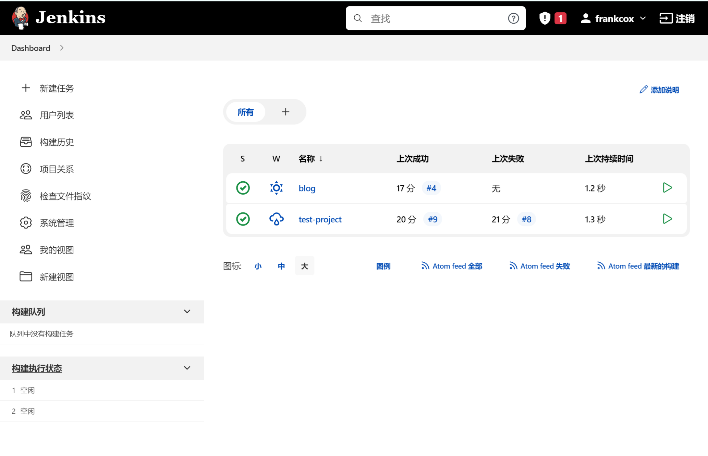

# 使用jenkins辅助实现github的博客自动化部署 
本站博客使用的是hugo的服务器本地部署模式，使用nginx来代理public文件夹，这样在content/post下创建新文章后，只需要在blog目录下执行``hugo -D`` 便可以实现更新。
考虑到直接在服务器上编辑文章的使用体验并不是很好，因此考虑在本地提交文章后利用github的webhook实现同步部署，在本地执行post后，jenkins将执行对应的CICD任务，实现部署。
具体部署流程：
首先安装jenkins，服务器是腾讯云轻量服务器，系统为Ubuntu 20.04，具体流程可参考：
https://adatiya.com/post/12082.html
之后进入主页面，配置jenkins相关的参数

配置好gitub的webhook与项目地址，此处可参考网上其他博客。
之后选择创建一个freestyle项目，执行shell脚本即可：
```
#!/bin/bash

rm -rf blog
git clone https://github.com/CirillaQL/blog.git
cp -r ./blog/* /home/ubuntu/blog/content/post
cd /home/ubuntu/blog
hugo -D
```
**注意，此处需要修改jenkins用户的权限问题，否则会有permission denied的错误**
之后再本地执行``git push`` 后，jenkins便可以通过webhook来实现自动化部署。